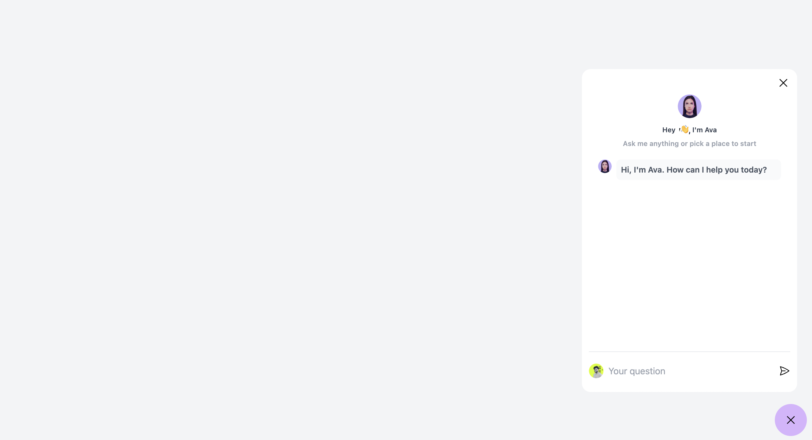
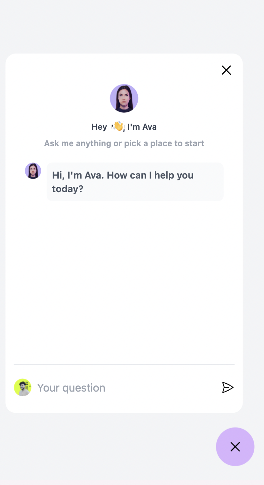

# Chat Widget Project

 

## Table of Contents

- [Chat Widget Project](#chat-widget-project)
  - [Table of Contents](#table-of-contents)
  - [Project Overview](#project-overview)
  - [Tech Stack](#tech-stack)
    - [Backend](#backend)
    - [Frontend](#frontend)
  - [Getting Started](#getting-started)
    - [Prerequisites](#prerequisites)
    - [Installation](#installation)
  - [Running the Application](#running-the-application)
    - [Using Docker Compose (Recommended)](#using-docker-compose-recommended)
    - [Running Individually](#running-individually)
      - [Backend](#backend-1)
      - [Frontend](#frontend-1)
  - [API Endpoints](#api-endpoints)
  - [Project Structure](#project-structure)
  - [Running Tests](#running-tests)

## Project Overview

This project is a Chat Widget application with separate frontend and backend components. The backend is built with FastAPI and provides the API for chat functionality, while the frontend is a React application that provides the user interface for the chat widget.

## Tech Stack

### Backend

- Python 3.12
- FastAPI
- SQLAlchemy
- OpenAI API (optional)
- Poetry (for dependency management)

### Frontend

- React 18+
- TypeScript
- Vite (for build tooling)
- Tailwind CSS
- Axios (for API requests)
- Headless UI (for accessible UI components)
- Hero Icons

## Getting Started

### Prerequisites

- Docker and Docker Compose (for easy setup)
- Alternatively:
  - Python 3.12
  - Node.js 14.0 or higher
  - npm or yarn
  - Poetry

### Installation

1. Clone the repository:
   ```
   git clone https://github.com/rajharsh81070/chatbot-widget.git
   cd chatbot-widget
   ```

2. Create a `.env` file in the `server` directory:
   ```
   cp server/.env.example server/.env
   ```
   Edit the `.env` file with your configuration.

## Running the Application

### Using Docker Compose (Recommended)

To run both the frontend and backend together:

```
docker compose up --build
```

This command will build the Docker images if they don't exist and start the containers. The services will be available at:

- Backend: http://localhost:8000
- Frontend: http://localhost:5173

To stop the application:

```
docker compose down
```

### Running Individually

If you prefer to run the services separately without Docker, follow these steps:

#### Backend

1. Navigate to the server directory:
   ```
   cd server
   ```

2. Install dependencies using Poetry:
   ```
   poetry install
   ```

3. Run the backend:
   ```
   poetry run uvicorn app.main:app --reload
   ```

The API will be available at `http://localhost:8000`.

#### Frontend

1. Navigate to the client directory:
   ```
   cd client
   ```

2. Install dependencies:
   ```
   npm install
   ```

3. Run the frontend development server:
   ```
   npm run dev
   ```

The application will be available at `http://localhost:5173`.

## API Endpoints

For a detailed list of API endpoints and their request/response structures, please refer to the [API Documentation](server/API_DOCUMENTATION.md) in the server directory.

## Project Structure

```
chatbot-widget/
├── server/
│   ├── app/
│   │   ├── controllers/
│   │   ├── core/
│   │   ├── models/
│   │   ├── routes/
│   │   ├── schemas/
│   │   ├── services/
│   │   ├── __init__.py
│   │   └── main.py
│   ├── tests/
│   ├── data/
│   ├── .env.example
│   ├── Dockerfile
│   └── pyproject.toml
│   └── API_DOCUMENTATION.md
│   └── README.md
├── client/
│   ├── src/
│   │   ├── components/
│   │   ├── services/
│   │   ├── types.ts
│   │   ├── constant.ts
│   │   ├── App.tsx
│   │   └── main.tsx
│   ├── Dockerfile
│   ├── package.json
│   └── vite.config.ts
│   └── README.md
├── docker-compose.yml
└── README.md
```

## Running Tests

To run the backend tests:

```
cd server
poetry run pytest
```